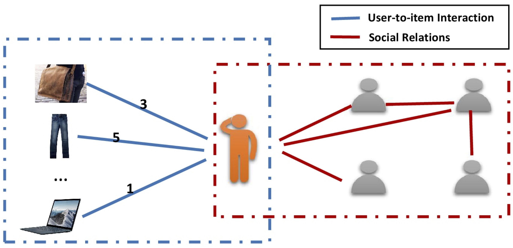

# GraphRec-WWW19

## GraphRec: Graph Neural Networks for Social Recommendation

This is our implementation for the paper:

[**<u>Wenqi Fan</u>**](https://wenqifan03.github.io), Yao Ma , Qing Li, Yuan He, Eric Zhao, Jiliang Tang, and Dawei Yin. [Graph Neural Networks for Social Recommendation](https://arxiv.org/pdf/1902.07243.pdf). 
In Proceedings of the 28th International Conference on World Wide Web (WWW), 2019. 
Preprint[https://arxiv.org/abs/1902.07243]


## Abstract
In recent years, Graph Neural Networks (GNNs), which can naturally integrate node information and topological structure, have been demonstrated to be powerful in learning on graph data. These advantages of GNNs provide great potential to ad- vance social recommendation since data in social recommender systems can be represented as user-user social graph and user-item graph; and learning latent factors of users and items is the key. However, building social recommender systems based on GNNs faces challenges. For example, the user-item graph encodes both interactions and their associated opinions; social relations have heterogeneous strengths; users involve in two graphs (e.g., the user-user social graph and the user-item graph). To address the three aforementioned challenges simultaneously, in this paper, we present a novel graph neural network framework (GraphRec) for social recommendations. In particular, we provide a principled approach to jointly capture interactions and opinions in the user-item graph and propose the framework GraphRec, which coherently models two graphs and heterogeneous strengths. Extensive experiments on two real-world datasets demonstrate the effectiveness of the proposed framework GraphRec.


## Introduction
 Graph Data in Social Recommendation. It contains two graphs including the user-item graph (left part) and the user-user social graph (right part). Note that the number on the edges of the user-item graph denotes the opinions (or rating score) of users on the items via the interactions.



## Our Model GraphRec
The overall architecture of the proposed model. It contains three major components: user modeling, item modeling, and rating prediction.The first component is user modeling, which is to learn latent factors of users. As data in social recommender systems includes two different graphs, i.e., a social graph and a user-item graph, we are provided with a great opportunity to learn user representations from different perspectives. Therefore, two aggregations are introduced to respectively process these two different graphs. One is item aggregation, which can be utilized to understand users via interactions between users and items in the user-item graph (or item-space). The other is social aggregation, the relationship between users in the social graph, which can help model users from the social perspective (or social-space). Then, it is intuitive to obtain user latent factors by combining information from both item space and social space. The second component is item modeling, which is to learn latent factors of items. In order to consider both interactions and opinions in the user-item graph, we introduce user aggregation, which is to aggregate users’ opinions in item modeling. The third component is to learn model parameters via prediction by integrating user and item modeling components.


## Code

Author: Wenqi Fan (https://wenqifan03.github.io, email: wenqifan03@gmail.com) 

Also, I would be more than happy to provide a detailed answer for any questions you may have regarding GraphRec.

If you use this code, please cite our paper:
```
@inproceedings{fan2019graph,
  title={Graph Neural Networks for Social Recommendation},
  author={Fan, Wenqi and Ma, Yao and Li, Qing and He, Yuan and Zhao, Eric and Tang, Jiliang and Yin, Dawei},
  booktitle={The World Wide Web Conference},
  pages={417--426},
  year={2019},
  organization={ACM}
}
```

## Environment Settings
##### python: 3.6
##### pytorch: 0.2+

## Example to run the codes

Run GraphRec:
```
python run_GraphRec_example.py
```

Raw Datasets (Ciao and Epinions)  can be downloaded at [http://www.cse.msu.edu/~tangjili/trust.html](http://www.cse.msu.edu/~tangjili/trust.html)

## Deep Neural Networks for Social Recommendations

*  **<u>Wenqi Fan</u>**, Yao Ma , Qing Li, Jianping Wang, Guoyong Cai, Jiliang Tang, and Dawei Yin. **A Graph Neural Network Framework for Social Recommendations.** To appear in IEEE TRANSACTIONS ON KNOWLEDGE AND DATA ENGINEERING (IEEE TKDE), 2020.

* **<u>Wenqi Fan</u>**, Yao Ma, Dawei Yin, Jianping Wang, Jiliang Tang, Qing Li.
  **Deep Social Collaborative Filtering.** In Proceedings of the 13th ACM Conference on Recommender Systems (RecSys 2019), 2019. (Long Paper,  Acceptance rate: 19%.) [[Arxiv](https://arxiv.org/abs/1907.06853)]    

* **<u>Wenqi Fan</u>**, Tyler Derr, Yao Ma, Jianping Wang, Jiliang Tang, Qing Li.
  **Deep Adversarial Social Recommendation.**  In Proceedings of the International Joint Conference on Artificial Intelligence (IJCAI), 2019. [[Arxiv](https://arxiv.org/abs/1905.13160)]   [[Slides](https://drive.google.com/file/d/1lCvxGlkBm6ux3KderXlE0YE9ELSHlfbh/view?usp=sharing)]

* **<u>Wenqi Fan</u>**, Qing Li, Min Cheng. **Deep Modeling of Social Relations for Recommendation.**  In Proceedings of the Thirty-Second AAAI Conference on Artificial Intelligence. 2018. (Student Poster.)  [[PDF](https://www.aaai.org/ocs/index.php/AAAI/AAAI18/paper/viewPaper/16075)]


# Acknowledgements
The original version of this code base was from GraphSage. We owe many thanks to William L. Hamilton for making his code available. 
Please see the paper for funding details and additional (non-code related) acknowledgements.

Last Update Date: Oct, 2019
