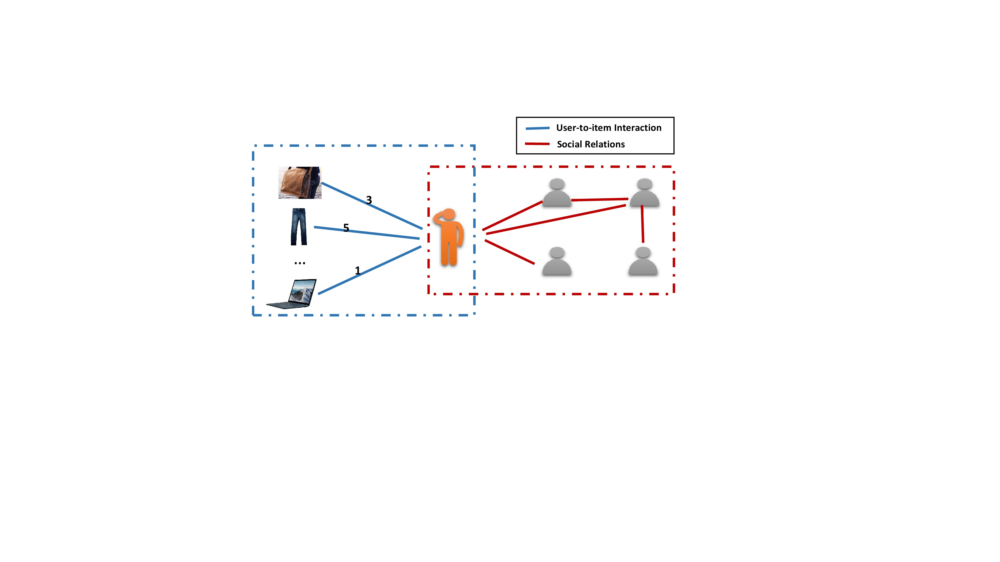

# GraphRec-WWW19

## GraphRec: Graph Neural Networks for Social Recommendation

This is our implementation for the paper:

[Wenqi Fan](https://wenqifan03.github.io), Yao Ma , Qing Li, Yuan He, Eric Zhao, Jiliang Tang, and Dawei Yin. [Graph Neural Networks for Social Recommendation](https://arxiv.org/pdf/1902.07243.pdf). 
In Proceedings of the 28th International Conference on World Wide Web (WWW), 2019. 
Preprint[https://arxiv.org/abs/1902.07243]


# Introduction
 Graph Data in Social Recommendation. It contains two graphs including the user-item graph (left part) and the user-user social graph (right part). Note that the number on the edges of the user-item graph denotes the opinions (or rating score) of users on the items via the interactions.



Author: Wenqi Fan (https://wenqifan03.github.io, email: wenqifan03@gmail.com) 

Also, I would be more than happy to provide a detailed answer for any questions you may have regarding GraphRec.

If you use this code, please cite our paper:
```
@inproceedings{fan2019graph,
  title={Graph Neural Networks for Social Recommendation},
  author={Fan, Wenqi and Ma, Yao and Li, Qing and He, Yuan and Zhao, Eric and Tang, Jiliang and Yin, Dawei},
  booktitle={WWW},
  year={2019}
}
```

## Environment Settings
python: 3.6
pytorch: >0.2

## Example to run the codes

Run GraphRec:
```
python run_GraphRec_example.py
```

# Acknowledgements
The original version of this code base was from GraphSage. We owe many thanks to William L. Hamilton for making his code available. 
Please see the paper for funding details and additional (non-code related) acknowledgements.

Last Update Date: Oct, 2019
